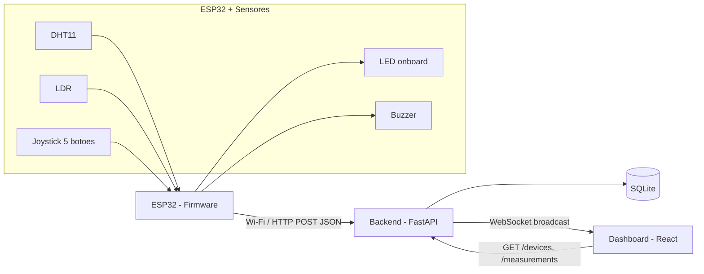
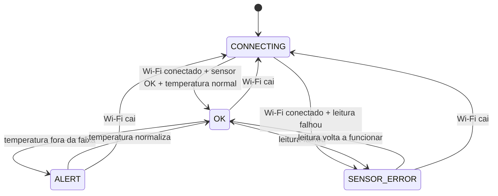

# Arquitetura

## Visão geral



## Fluxo de dados

1. O ESP32 le os sensores a cada `PUBLISH_INTERVAL_MS` (10s por padrao) ou imediatamente apos o botao central do joystick ser pressionado.
2. O firmware monta um payload JSON e envia via `POST /measurements` para o backend.
3. O backend valida o payload, cria/atualiza o registro do dispositivo (`devices`), grava a medicao (`measurements`) e transmite a leitura para todos os clientes conectados via WebSocket (`/ws`).
4. O backend tambem transmite periodicamente (a cada `STATUS_BROADCAST_INTERVAL_SECONDS`, 5s por padrao) o status online/offline de todos os dispositivos, calculado a partir de `last_seen`.
5. O dashboard React carrega o estado inicial via REST (`GET /devices`, `GET /measurements`) e depois consome o WebSocket para atualizacoes em tempo real, sem precisar dar polling.

## Contrato da API

| Metodo | Rota | Descricao |
|---|---|---|
| `POST` | `/measurements` | Recebe uma leitura do ESP32, cria o dispositivo se nao existir, transmite via WS |
| `GET` | `/measurements` | Lista leituras, filtros: `device_id`, `since`, `limit` |
| `GET` | `/devices` | Lista todos os dispositivos com status online/offline e ultima leitura |
| `GET` | `/devices/{id}` | Detalhe de um dispositivo |
| `WS` | `/ws` | Canal de eventos em tempo real (`type: "measurement"` e `type: "status"`) |

### Payload de entrada (`POST /measurements`)

```json
{
  "device": "VTX001",
  "temperature": 26.3,
  "humidity": 61,
  "luminosity": 420,
  "timestamp": "2026-07-06T10:00:00"
}
```

### Mensagens WebSocket

```json
{ "type": "measurement", "data": { ... }, "device": { ... } }
{ "type": "status", "devices": [ { ... }, { ... } ] }
```

## Esquema do banco de dados

- `devices(id PK, first_seen, last_seen)`
- `measurements(id PK, device_id FK -> devices.id, temperature, humidity, luminosity, timestamp, received_at)`

Status online/offline e derivado (nao armazenado): um dispositivo esta `online` se `now - last_seen <= OFFLINE_THRESHOLD_SECONDS` (30s por padrao).

## Maquina de estados do firmware



LED onboard (Wemos D1 R32, cor unica — sem LED RGB externo): estado comunicado pelo padrao de piscada, nao por cor. `CONNECTING` = piscando lento (500ms), `OK` = aceso fixo, `ALERT`/`SENSOR_ERROR` = piscando rapido (150ms). O buzzer soa apenas em `ALERT`, e pode ser silenciado pelo botao central do joystick ate a proxima vez que o alerta for disparado novamente.
