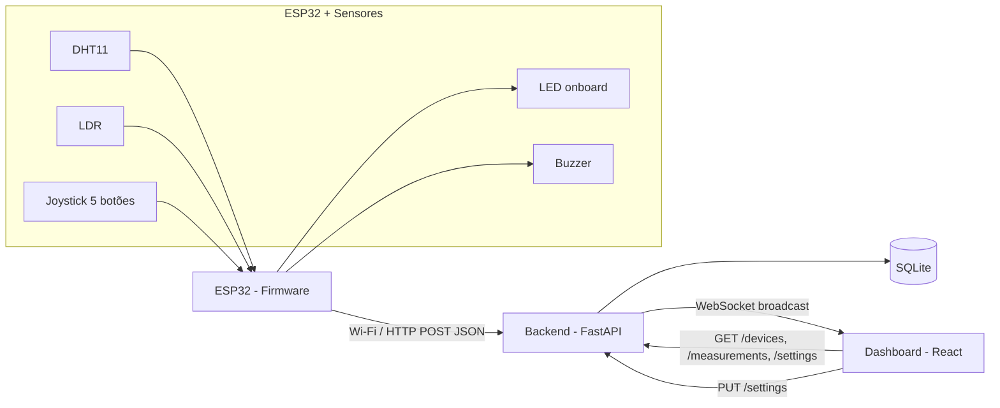
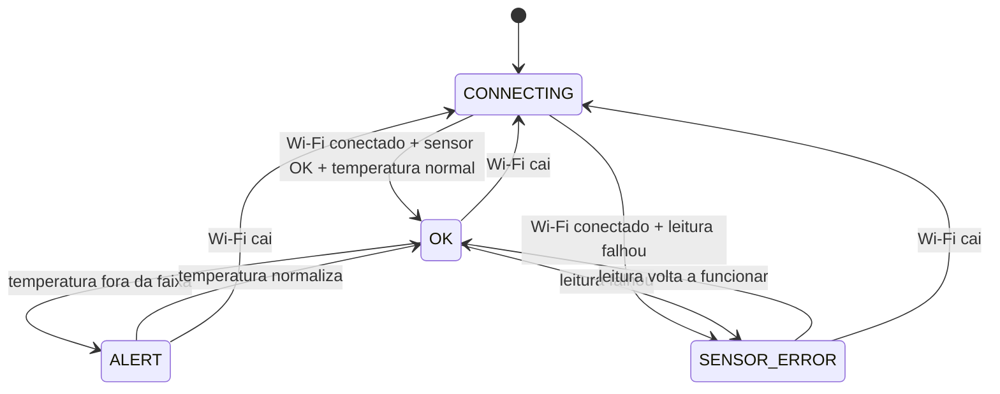

# Arquitetura

## Visão geral



## Fluxo de dados

1. O ESP32 lê os sensores a cada `PUBLISH_INTERVAL_MS` (10s por padrão) ou imediatamente após o botão central do joystick ser pressionado, e busca `GET /settings` no mesmo ciclo (ver "Limites de alerta" abaixo).
2. O firmware monta um payload JSON e envia via `POST /measurements` para o backend.
3. O backend valida o payload, cria/atualiza o registro do dispositivo (`devices`), grava a medição (`measurements`) e transmite a leitura para todos os clientes conectados via WebSocket (`/ws`).
4. O backend também transmite periodicamente (a cada `STATUS_BROADCAST_INTERVAL_SECONDS`, 5s por padrão) o status online/offline de todos os dispositivos, calculado a partir de `last_seen`.
5. O dashboard React carrega o estado inicial via REST (`GET /devices`, `GET /measurements`, `GET /settings`) e depois consome o WebSocket para atualizações em tempo real, sem precisar dar polling.

## Contrato da API

| Método | Rota | Descrição |
|---|---|---|
| `POST` | `/measurements` | Recebe uma leitura do ESP32, cria o dispositivo se não existir, transmite via WS |
| `GET` | `/measurements` | Lista leituras, filtros: `device_id`, `since`, `until`, `limit` |
| `GET` | `/devices` | Lista todos os dispositivos com status online/offline e última leitura |
| `GET` | `/devices/{id}` | Detalhe de um dispositivo |
| `GET` | `/settings` | Limites de alerta atuais (temperatura máxima/mínima) |
| `PUT` | `/settings` | Atualiza os limites de alerta (valida `temp_low < temp_high`) |
| `WS` | `/ws` | Canal de eventos em tempo real (`type: "measurement"`, `type: "status"`, `type: "settings"`) |

### Payload de entrada (`POST /measurements`)

```json
{
  "device": "VTX001",
  "temperature": 26.3,
  "humidity": 61,
  "luminosity": 420,
  "timestamp": "2026-07-06T10:00:00",
  "trigger": "interval"
}
```

`trigger` é opcional (default `"interval"`) e não é persistido no banco - só existe para o dashboard destacar quando uma leitura veio do botão físico. Valores possíveis: `"interval"` (ciclo normal), `"boot"` (primeiro envio ao ligar) ou `"button"` (forçado pelo botão central do joystick).

### Mensagens WebSocket

```json
{ "type": "measurement", "data": { ... }, "device": { ... }, "trigger": "interval" }
{ "type": "status", "devices": [ { ... }, { ... } ] }
{ "type": "settings", "data": { "temp_high_threshold": 30.0, "temp_low_threshold": 10.0 } }
```

## Esquema do banco de dados

- `devices(id PK, first_seen, last_seen)`
- `measurements(id PK, device_id FK -> devices.id, temperature, humidity, luminosity, timestamp, received_at)`
- `settings(id PK, temp_high_threshold, temp_low_threshold)` - linha única (id=1), configuração global de alerta

Retenção de dados: um processo em background (`cleanup_loop`) roda a cada `CLEANUP_INTERVAL_SECONDS` (1h por padrão, também uma vez imediatamente no boot) e apaga medições com `received_at` mais antigo que `MEASUREMENT_RETENTION_DAYS` (2 dias por padrão). Sem isso a tabela `measurements` cresceria indefinidamente, já que não há nenhum outro mecanismo de expurgo.

## Pesquisa histórica

O card "Pesquisar por data e hora" no dashboard deixa escolher um instante e uma janela (+/- 15min a +/- 6h), consulta `GET /measurements?since=...&until=...` e mostra estatísticas (mín/média/máx) e gráficos de temperatura/umidade/luminosidade daquele período, sem interferir na visualização "ao vivo" dos cards do topo.

## Limites de alerta configuráveis pelo dashboard

O card "Configuração de alerta" no dashboard permite editar `temp_high_threshold`/`temp_low_threshold` sem regravar o firmware. Como o ESP32 nunca recebe conexão (só faz requisições), ele busca esses valores via `GET /settings` a cada ciclo de publicação (`PUBLISH_INTERVAL_MS`, 10s por padrão) - ou seja, uma mudança no dashboard leva até um ciclo para ser aplicada no firmware físico. Os valores em `Firmware/include/config.h` (`TEMP_HIGH_THRESHOLD_C`/`TEMP_LOW_THRESHOLD_C`) continuam existindo como fallback: são usados no boot e sempre que o `GET /settings` falha (Wi-Fi fora do ar, backend indisponível).

Status online/offline é derivado (não armazenado): um dispositivo está `online` se `now - last_seen <= OFFLINE_THRESHOLD_SECONDS` (30s por padrão).

## Máquina de estados do firmware



LED onboard (Wemos D1 R32, cor única — sem LED RGB externo): estado comunicado pelo padrão de piscada, não por cor. `CONNECTING` = piscando lento (500ms), `OK` = aceso fixo, `ALERT`/`SENSOR_ERROR` = piscando rápido (150ms). O buzzer soa apenas em `ALERT`, em bipes periódicos (150ms ligado / 350ms desligado, configurável via `BUZZER_BEEP_ON_MS`/`BUZZER_BEEP_OFF_MS` em `config.h`) em vez de tom contínuo, e pode ser silenciado pelo botão central do joystick até a próxima vez que o alerta for disparado novamente.

## Deploy: Render + Cloudflare Worker (domínio próprio)

Produção roda em três peças: backend (Render Web Service, Docker), frontend (Render Static Site, build com `VITE_BASE_PATH=/iot-dashboard/`) e um Cloudflare Worker (`docs/cloudflare-worker.js`) que faz proxy de `pulseorigin.com.br/iot-dashboard*` para o Static Site do Render, removendo o prefixo antes de repassar. Passo a passo completo em `docs/deploy.md`.
