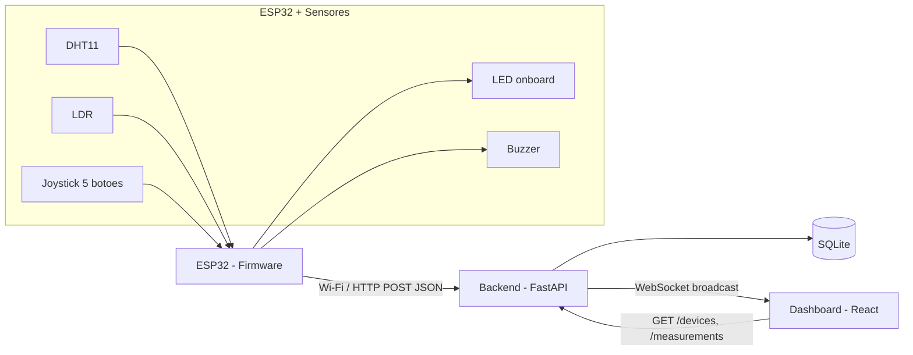
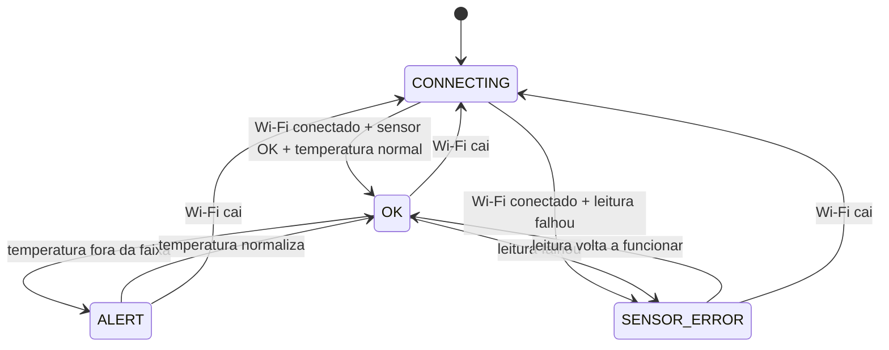

# Arquitetura

## Visão geral



## Fluxo de dados

1. O ESP32 le os sensores a cada `PUBLISH_INTERVAL_MS` (10s por padrao) ou imediatamente apos o botao central do joystick ser pressionado.
2. O firmware monta um payload JSON e envia via `POST /measurements` para o backend.
3. O backend valida o payload, cria/atualiza o registro do dispositivo (`devices`), grava a medicao (`measurements`) e transmite a leitura para todos os clientes conectados via WebSocket (`/ws`).
4. O backend tambem transmite periodicamente (a cada `STATUS_BROADCAST_INTERVAL_SECONDS`, 5s por padrao) o status online/offline de todos os dispositivos, calculado a partir de `last_seen`.
5. O dashboard React carrega o estado inicial via REST (`GET /devices`, `GET /measurements`) e depois consome o WebSocket para atualizacoes em tempo real, sem precisar dar polling.

## Contrato da API

| Metodo | Rota | Descricao |
|---|---|---|
| `POST` | `/measurements` | Recebe uma leitura do ESP32, cria o dispositivo se nao existir, transmite via WS |
| `GET` | `/measurements` | Lista leituras, filtros: `device_id`, `since`, `until`, `limit` |
| `GET` | `/devices` | Lista todos os dispositivos com status online/offline e ultima leitura |
| `GET` | `/devices/{id}` | Detalhe de um dispositivo |
| `GET` | `/settings` | Limites de alerta atuais (temperatura maxima/minima) |
| `PUT` | `/settings` | Atualiza os limites de alerta (valida `temp_low < temp_high`) |
| `WS` | `/ws` | Canal de eventos em tempo real (`type: "measurement"`, `type: "status"`, `type: "settings"`) |

### Payload de entrada (`POST /measurements`)

```json
{
  "device": "VTX001",
  "temperature": 26.3,
  "humidity": 61,
  "luminosity": 420,
  "timestamp": "2026-07-06T10:00:00"
}
```

### Mensagens WebSocket

```json
{ "type": "measurement", "data": { ... }, "device": { ... } }
{ "type": "status", "devices": [ { ... }, { ... } ] }
```

## Esquema do banco de dados

- `devices(id PK, first_seen, last_seen)`
- `measurements(id PK, device_id FK -> devices.id, temperature, humidity, luminosity, timestamp, received_at)`
- `settings(id PK, temp_high_threshold, temp_low_threshold)` - linha unica (id=1), configuracao global de alerta

Retencao de dados: um processo em background (`cleanup_loop`) roda a cada `CLEANUP_INTERVAL_SECONDS` (1h por padrao, tambem uma vez imediatamente no boot) e apaga medicoes com `received_at` mais antigo que `MEASUREMENT_RETENTION_DAYS` (2 dias por padrao). Sem isso a tabela `measurements` cresceria indefinidamente, ja que nao ha nenhum outro mecanismo de expurgo.

## Pesquisa historica

O card "Pesquisar por data e hora" no dashboard deixa escolher um instante e uma janela (+/- 15min a +/- 6h), consulta `GET /measurements?since=...&until=...` e mostra estatisticas (min/media/max) e graficos de temperatura/umidade/luminosidade daquele periodo, sem interferir na visualizacao "ao vivo" dos cards do topo.

## Limites de alerta configuraveis pelo dashboard

O card "Configuracao de alerta" no dashboard permite editar `temp_high_threshold`/`temp_low_threshold` sem regravar o firmware. Como o ESP32 nunca recebe conexao (so faz requisicoes), ele busca esses valores via `GET /settings` a cada ciclo de publicacao (`PUBLISH_INTERVAL_MS`, 10s por padrao) - ou seja, uma mudanca no dashboard leva ate um ciclo para ser aplicada no firmware fisico. Os valores em `Firmware/include/config.h` (`TEMP_HIGH_THRESHOLD_C`/`TEMP_LOW_THRESHOLD_C`) continuam existindo como fallback: sao usados no boot e sempre que o `GET /settings` falha (Wi-Fi fora do ar, backend indisponivel).

Status online/offline e derivado (nao armazenado): um dispositivo esta `online` se `now - last_seen <= OFFLINE_THRESHOLD_SECONDS` (30s por padrao).

## Maquina de estados do firmware



LED onboard (Wemos D1 R32, cor unica — sem LED RGB externo): estado comunicado pelo padrao de piscada, nao por cor. `CONNECTING` = piscando lento (500ms), `OK` = aceso fixo, `ALERT`/`SENSOR_ERROR` = piscando rapido (150ms). O buzzer soa apenas em `ALERT`, em bipes periodicos (150ms ligado / 350ms desligado, configuravel via `BUZZER_BEEP_ON_MS`/`BUZZER_BEEP_OFF_MS` em `config.h`) em vez de tom continuo, e pode ser silenciado pelo botao central do joystick ate a proxima vez que o alerta for disparado novamente.

## Deploy: Render + Cloudflare Worker (dominio proprio)

Producao roda em tres pecas: backend (Render Web Service, Docker), frontend (Render Static Site, build com `base: "/iot-dashboard/"`) e um Cloudflare Worker (`docs/cloudflare-worker.js`) que faz proxy de `pulseorigin.com.br/iot-dashboard*` para o Static Site do Render, removendo o prefixo antes de repassar. Ver secao "Deploy em nuvem" no README para o passo a passo completo.
