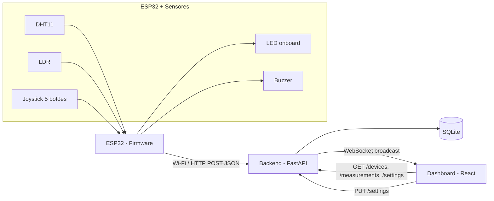
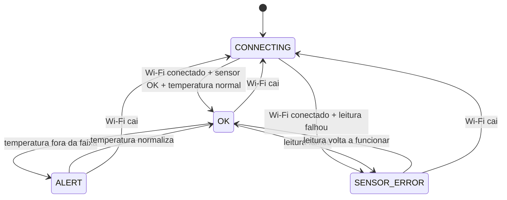
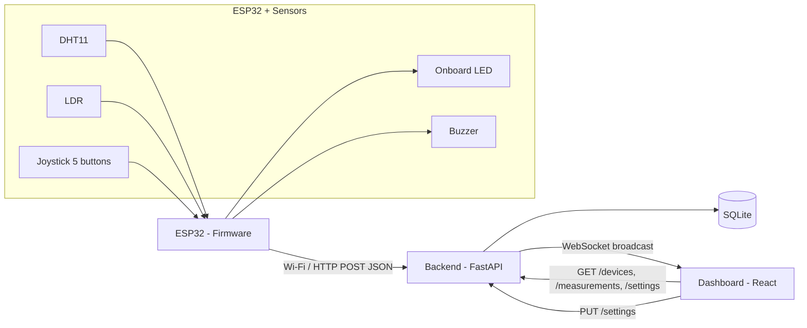
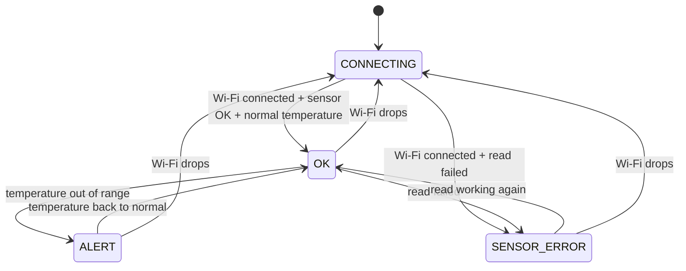

# Arquitetura

## Visão geral



## Fluxo de dados

1. O ESP32 lê os sensores a cada `PUBLISH_INTERVAL_MS` (10s por padrão) ou imediatamente após o botão central do joystick ser pressionado, e busca `GET /settings` no mesmo ciclo (ver "Limites de alerta" abaixo).
2. O firmware monta um payload JSON e envia via `POST /measurements` para o backend.
3. O backend valida o payload, cria/atualiza o registro do dispositivo (`devices`), grava a medição (`measurements`) e transmite a leitura para todos os clientes conectados via WebSocket (`/ws`).
4. O backend também transmite periodicamente (a cada `STATUS_BROADCAST_INTERVAL_SECONDS`, 5s por padrão) o status online/offline de todos os dispositivos, calculado a partir de `last_seen`.
5. O dashboard React carrega o estado inicial via REST (`GET /devices`, `GET /measurements`, `GET /settings`) e depois consome o WebSocket para atualizações em tempo real, sem precisar dar polling.

## Contrato da API

| Método | Rota | Descrição |
|---|---|---|
| `POST` | `/measurements` | Recebe uma leitura do ESP32, cria o dispositivo se não existir, transmite via WS |
| `GET` | `/measurements` | Lista leituras, filtros: `device_id`, `since`, `until`, `limit` |
| `GET` | `/devices` | Lista todos os dispositivos com status online/offline e última leitura |
| `GET` | `/devices/{id}` | Detalhe de um dispositivo |
| `GET` | `/settings` | Limites de alerta atuais (temperatura máxima/mínima) |
| `PUT` | `/settings` | Atualiza os limites de alerta (valida `temp_low < temp_high`) |
| `WS` | `/ws` | Canal de eventos em tempo real (`type: "measurement"`, `type: "status"`, `type: "settings"`) |

### Payload de entrada (`POST /measurements`)

```json
{
  "device": "VTX001",
  "temperature": 26.3,
  "humidity": 61,
  "luminosity": 420,
  "timestamp": "2026-07-06T10:00:00",
  "trigger": "interval"
}
```

`trigger` é opcional (default `"interval"`) e não é persistido no banco - só existe para o dashboard destacar quando uma leitura veio do botão físico. Valores possíveis: `"interval"` (ciclo normal), `"boot"` (primeiro envio ao ligar) ou `"button"` (forçado pelo botão central do joystick).

### Mensagens WebSocket

```json
{ "type": "measurement", "data": { ... }, "device": { ... }, "trigger": "interval" }
{ "type": "status", "devices": [ { ... }, { ... } ] }
{ "type": "settings", "data": { "temp_high_threshold": 30.0, "temp_low_threshold": 10.0 } }
```

## Esquema do banco de dados

- `devices(id PK, first_seen, last_seen)`
- `measurements(id PK, device_id FK -> devices.id, temperature, humidity, luminosity, timestamp, received_at)`
- `settings(id PK, temp_high_threshold, temp_low_threshold)` - linha única (id=1), configuração global de alerta

Retenção de dados: um processo em background (`cleanup_loop`) roda a cada `CLEANUP_INTERVAL_SECONDS` (1h por padrão, também uma vez imediatamente no boot) e apaga medições com `received_at` mais antigo que `MEASUREMENT_RETENTION_DAYS` (2 dias por padrão). Sem isso a tabela `measurements` cresceria indefinidamente, já que não há nenhum outro mecanismo de expurgo.

## Pesquisa histórica

O card "Pesquisar por data e hora" no dashboard deixa escolher um instante e uma janela (+/- 30min a +/- 24h), consulta `GET /measurements?since=...&until=...` e mostra estatísticas (mín/média/máx) e gráficos de temperatura/umidade/luminosidade daquele período, sem interferir na visualização "ao vivo" dos cards do topo. O limite de linhas buscadas escala com o tamanho da janela (baseado no intervalo de publicação do firmware), para não truncar janelas maiores.

Os resultados podem ser exportados em CSV (botão "Exportar CSV", gerado 100% no navegador, sem chamada extra ao backend) com as colunas `timestamp, temperature_c, humidity_pct, luminosity_raw, luminosity_pct` - inclui o valor bruto da luminosidade e a porcentagem convertida, em ordem cronológica (mais antigo primeiro). Também dá pra exportar em PDF (botão "Exportar PDF", via `jspdf`/`jspdf-autotable`), com um relatório formatado: cabeçalho com os parâmetros da busca, tabela de estatísticas (mín/média/máx) e a tabela completa de leituras paginada automaticamente.

## Limites de alerta configuráveis pelo dashboard

O card "Configuração de alerta" no dashboard permite editar `temp_high_threshold`/`temp_low_threshold` sem regravar o firmware. Como o ESP32 nunca recebe conexão (só faz requisições), ele busca esses valores via `GET /settings` a cada ciclo de publicação (`PUBLISH_INTERVAL_MS`, 10s por padrão) - ou seja, uma mudança no dashboard leva até um ciclo para ser aplicada no firmware físico. Os valores em `Firmware/include/config.h` (`TEMP_HIGH_THRESHOLD_C`/`TEMP_LOW_THRESHOLD_C`) continuam existindo como fallback: são usados no boot e sempre que o `GET /settings` falha (Wi-Fi fora do ar, backend indisponível).

Status online/offline é derivado (não armazenado): um dispositivo está `online` se `now - last_seen <= OFFLINE_THRESHOLD_SECONDS` (30s por padrão).

## Máquina de estados do firmware



LED onboard (Wemos D1 R32, cor única — sem LED RGB externo): estado comunicado pelo padrão de piscada, não por cor. `CONNECTING` = piscando lento (500ms), `OK` = aceso fixo, `ALERT`/`SENSOR_ERROR` = piscando rápido (150ms). O buzzer soa apenas em `ALERT`, em bipes periódicos (150ms ligado / 350ms desligado, configurável via `BUZZER_BEEP_ON_MS`/`BUZZER_BEEP_OFF_MS` em `config.h`) em vez de tom contínuo, e pode ser silenciado pelo botão central do joystick até a próxima vez que o alerta for disparado novamente.

## Deploy: Render + Cloudflare Worker (domínio próprio)

Produção roda em três peças: backend (Render Web Service, Docker), frontend (Render Static Site, build com `VITE_BASE_PATH=/iot-dashboard/`) e um Cloudflare Worker (`docs/cloudflare-worker.js`) que faz proxy de `pulseorigin.com.br/iot-dashboard*` para o Static Site do Render, removendo o prefixo antes de repassar. Passo a passo completo em `docs/deploy.md`.

---

# Architecture

*(English translation below - see above for the original Portuguese version.)*

## Overview



## Data flow

1. The ESP32 reads the sensors every `PUBLISH_INTERVAL_MS` (10s by default) or immediately after the joystick's center button is pressed, and fetches `GET /settings` in the same cycle (see "Dashboard-configurable alert thresholds" below).
2. The firmware builds a JSON payload and sends it via `POST /measurements` to the backend.
3. The backend validates the payload, creates/updates the device record (`devices`), stores the measurement (`measurements`), and broadcasts the reading to every connected WebSocket client (`/ws`).
4. The backend also periodically broadcasts (every `STATUS_BROADCAST_INTERVAL_SECONDS`, 5s by default) the online/offline status of every device, computed from `last_seen`.
5. The React dashboard loads its initial state over REST (`GET /devices`, `GET /measurements`, `GET /settings`) and then consumes the WebSocket for real-time updates, with no polling needed.

## API contract

| Method | Route | Description |
|---|---|---|
| `POST` | `/measurements` | Receives a reading from the ESP32, creates the device if it doesn't exist, broadcasts over WS |
| `GET` | `/measurements` | Lists readings, filters: `device_id`, `since`, `until`, `limit` |
| `GET` | `/devices` | Lists all devices with online/offline status and latest reading |
| `GET` | `/devices/{id}` | Detail for a single device |
| `GET` | `/settings` | Current alert thresholds (max/min temperature) |
| `PUT` | `/settings` | Updates the alert thresholds (validates `temp_low < temp_high`) |
| `WS` | `/ws` | Real-time event channel (`type: "measurement"`, `type: "status"`, `type: "settings"`) |

### Input payload (`POST /measurements`)

```json
{
  "device": "VTX001",
  "temperature": 26.3,
  "humidity": 61,
  "luminosity": 420,
  "timestamp": "2026-07-06T10:00:00",
  "trigger": "interval"
}
```

`trigger` is optional (default `"interval"`) and isn't persisted to the database - it only exists so the dashboard can highlight when a reading came from the physical button. Possible values: `"interval"` (normal cycle), `"boot"` (first send on power-up), or `"button"` (forced by the joystick's center button).

### WebSocket messages

```json
{ "type": "measurement", "data": { ... }, "device": { ... }, "trigger": "interval" }
{ "type": "status", "devices": [ { ... }, { ... } ] }
{ "type": "settings", "data": { "temp_high_threshold": 30.0, "temp_low_threshold": 10.0 } }
```

## Database schema

- `devices(id PK, first_seen, last_seen)`
- `measurements(id PK, device_id FK -> devices.id, temperature, humidity, luminosity, timestamp, received_at)`
- `settings(id PK, temp_high_threshold, temp_low_threshold)` - single row (id=1), global alert configuration

Data retention: a background process (`cleanup_loop`) runs every `CLEANUP_INTERVAL_SECONDS` (1h by default, also once immediately on boot) and deletes measurements with `received_at` older than `MEASUREMENT_RETENTION_DAYS` (2 days by default). Without this the `measurements` table would grow forever, since there's no other purge mechanism.

## Historical search

The "Search by date and time" card on the dashboard lets you pick an instant and a window (+/- 30min to +/- 24h), queries `GET /measurements?since=...&until=...`, and shows statistics (min/avg/max) and temperature/humidity/luminosity charts for that period, without interfering with the "live" cards at the top. The row limit for the query scales with the window size (based on the firmware's publish interval), so larger windows don't get truncated.

Results can be exported as CSV (the "Exportar CSV" button, generated entirely in the browser, no extra backend call) with columns `timestamp, temperature_c, humidity_pct, luminosity_raw, luminosity_pct` - includes both the raw luminosity value and the converted percentage, in chronological order (oldest first). A PDF export is also available (the "Exportar PDF" button, via `jspdf`/`jspdf-autotable`) as a formatted report: a header with the search parameters, a summary statistics table (min/avg/max), and the full readings table with automatic pagination.

## Dashboard-configurable alert thresholds

The "Alert configuration" card on the dashboard lets you edit `temp_high_threshold`/`temp_low_threshold` without reflashing the firmware. Since the ESP32 never receives inbound connections (it only makes requests), it fetches these values via `GET /settings` on every publish cycle (`PUBLISH_INTERVAL_MS`, 10s by default) - meaning a change on the dashboard takes up to one cycle to reach the physical firmware. The values in `Firmware/include/config.h` (`TEMP_HIGH_THRESHOLD_C`/`TEMP_LOW_THRESHOLD_C`) still exist as a fallback: they're used on boot and whenever `GET /settings` fails (Wi-Fi down, backend unavailable).

Online/offline status is derived (not stored): a device is `online` if `now - last_seen <= OFFLINE_THRESHOLD_SECONDS` (30s by default).

## Firmware state machine



Onboard LED (Wemos D1 R32, single color — no external RGB LED): state communicated by blink pattern, not color. `CONNECTING` = slow blink (500ms), `OK` = solid on, `ALERT`/`SENSOR_ERROR` = fast blink (150ms). The buzzer only sounds during `ALERT`, in periodic chirps (150ms on / 350ms off, configurable via `BUZZER_BEEP_ON_MS`/`BUZZER_BEEP_OFF_MS` in `config.h`) instead of a continuous tone, and can be silenced with the joystick's center button until the next time the alert fires again.

## Deploy: Render + Cloudflare Worker (custom domain)

Production runs as three pieces: backend (Render Web Service, Docker), frontend (Render Static Site, built with `VITE_BASE_PATH=/iot-dashboard/`), and a Cloudflare Worker (`docs/cloudflare-worker.js`) that proxies `pulseorigin.com.br/iot-dashboard*` to the Render Static Site, stripping the prefix before forwarding. Full step-by-step in `docs/deploy.md`.
